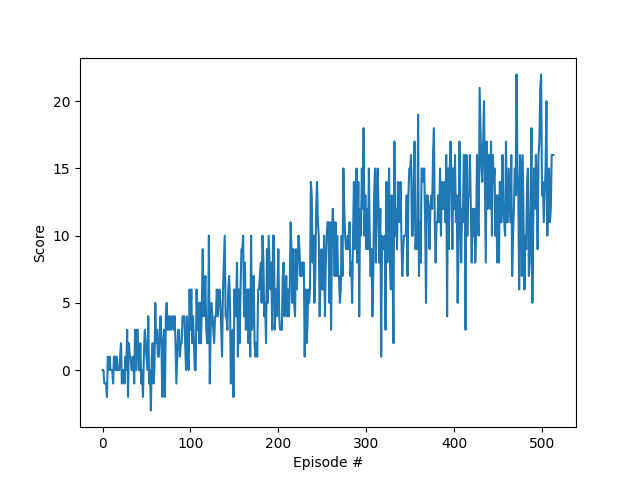

[//]: # (Image References)

# Report

## Learning Algorithm

### Hyperparameters
* Epsilon-greedy policy: definet balance between actual and future rewards.  

   Instead of letting the agent choosing the action with the maximum expected return,
   we let it choose a random action with probability **epsilon**.
   
   * EPS_START = `1.0`- Init value of epsilon
   * EPS_END = `0.01` - Minimum number of epsilon
   * EPS_DECAY = `0.995` - Decay factor of epsilon

* Discout Factor Gamma: Because future rewards are less predictable, it makes sense
for the agent to value immediate rewards more than future ones.
The choice for the **Discount Factor** gamma is of `0.99`

* Other hyperparameters (inside dqn_agent.py):
    * `BUFFER_SIZE = int(1e5)  # replay buffer size`
    * `BATCH_SIZE = 64         # minibatch size`
    * `TAU = 1e-3              # for soft update of target parameters`
    * `LR = 5e-4               # learning rate`
    * `UPDATE_EVERY = 4        # how often to update the network`

### Neural Network Architecture
The architecture of the neural network is quite simple:
* 2 Hidden layers with 64 neuron each and `ReLU` activation function
* 1 output linear layer with 4 neurons, one for each possible action

### Plot of Rewards
A plot of rewards per episode is included to illustrate that the agent is able to receive an average reward (over 100 episodes) of at least +13. The submission reports the number of episodes needed to solve the environment:
    

### Ideas for Future Work

* Hyperparameters tuning
* More time learning to reach higher Stop_reward value
* Tune Bayesian Optimizers to find the best combination of hyperparameters 
* Double DQN: Another improvement would be to try to use *Double DQN*. 
* There are 2 extra algorithms that could be interested to try:
    * **Prioritized experience replay**
    * **Dueling DQN**